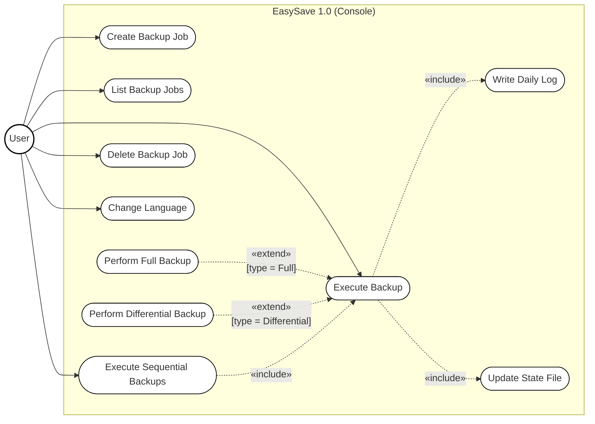
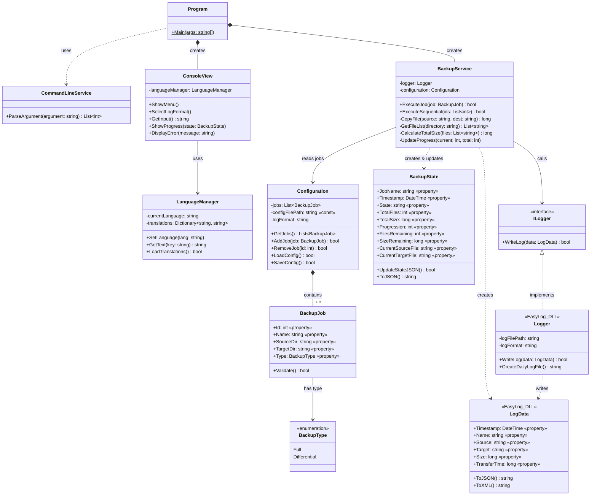
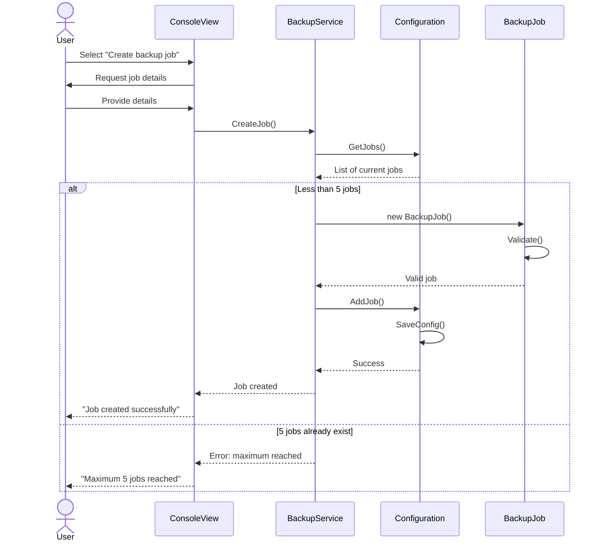
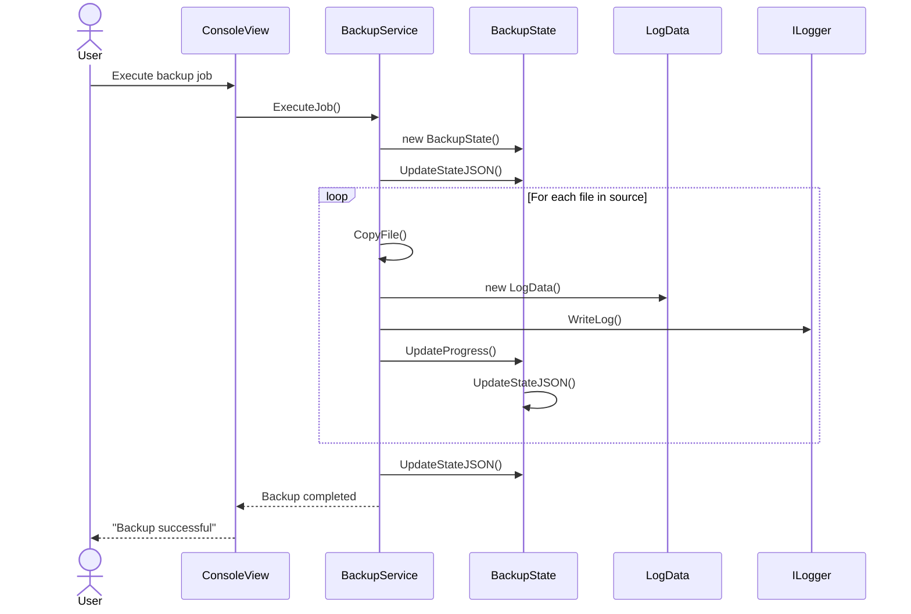
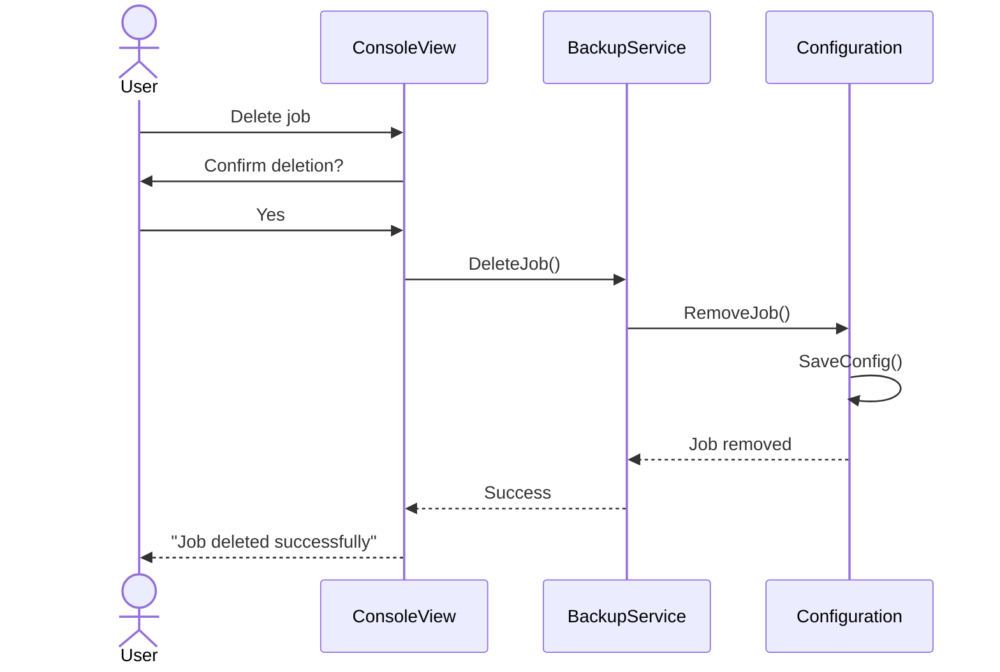
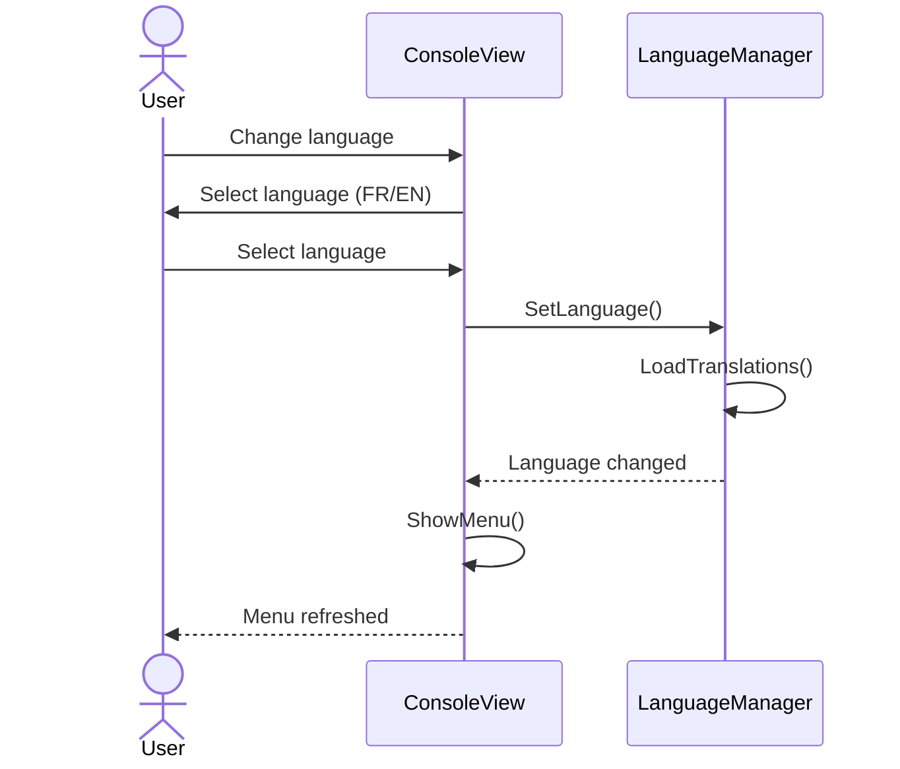
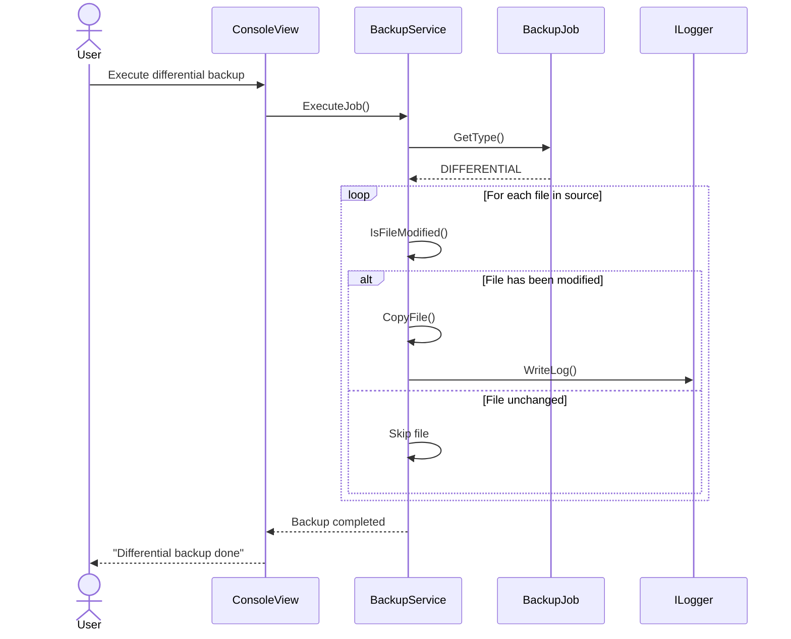
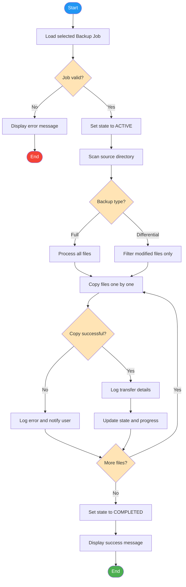

#  Diagrams EasySave 1.0 - Livrable 1

### Before writing code, the most critical is to have a clear and comprehensive understanding of the application's architecture. Rushing into implementation without proper planning often leads to a mid structured code, technical debt, and costly refactoring later in the project lifecycle.

## 1. Use Case

#### A Use Case Diagram is a behavioral UML diagram that captures the functional requirements of a system by showing the interactions between users (actors) and the system's features (use cases). This diagram provides a high-level overview of what the EasySave application can do from the user's perspective. It shows that a user can create, list, execute, and delete backup jobs, as well as change the application language. It also illustrates that backup jobs can be either Full or Differential, and that executing a backup includes generating logs and updating the state file.

    
## 2. Class

#### A Class Diagram is a structural UML diagram that represents the static structure of a system by showing its classes, attributes, methods, and the relationships between them. This diagram defines the architecture of the EasySave application. It shows how different components interact: the Program entry point connects to ConsoleView and Configuration, the BackupService handles the backup logic while updating BackupState and using the Logger (from an external DLL), and Configuration manages up to 5 BackupJob instances. The relationships (composition, association, dependency) clarify how objects are created and used throughout the system.

## 3. Sequence Diagram Creation backup

#### Here are some sequence diagram examples (creation, execution, deletion, etc.). More sequence diagrams can be added; these are just examples.

#### A Sequence Diagram is a behavioral UML diagram that shows how objects interact in a particular scenario over time, displaying the sequence of messages exchanged between participants.This diagram illustrates the step-by-step process of creating a new backup job. It shows the user providing job details through the console, the system checking if the maximum limit of 5 jobs has been reached, validating the new job, and persisting it to the configuration file. The alternative flow handles the case where the user has already reached the maximum number of jobs.

## 4. Sequence Diagram Execution backup

#### This diagram details the execution flow of a backup job. It demonstrates how the system transitions through states (ACTIVE → COMPLETED), processes each file in a loop, logs transfer information for every copied file, and continuously updates the progress displayed to the user. 

## 5. Sequence Diagram Supression backup

#### This diagram shows the important process of deleting a backup job. It emphasizes the confirmation step before deletion, ensuring the user consciously agrees to remove the job. This prevents accidental data loss.

## 6. Sequence Diagram switch languish

#### This diagram shows how the application handles language changes at runtime. When the user selects a new language, the LanguageManager loads the appropriate translations, the configuration is saved to persist the preference, and the interface refreshes to display text in the selected language. This supports the requirement (French/English) of the application.

## 7. Sequence Diagram differential backup

#### This diagram highlights the key difference between full and differential backups. Unlike a full backup that copies all files, a differential backup checks each file's modification date and only copies files that have changed since the last backup.

## 8. Activity diagram

#### An Activity Diagram is a behavioral UML diagram that models the workflow or business process of a system, showing the sequence of activities and decision points from start to finish. This comprehensive diagram provides a complete view of the backup execution workflow. It maps every step from job validation to completion, including decision points for backup type (full vs. differential), file comparison logic, error handling, logging operations, and progress tracking.

