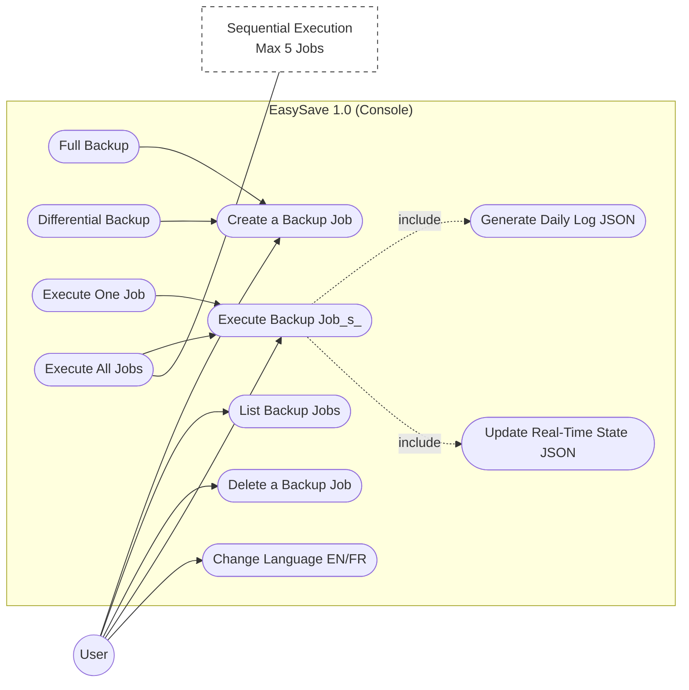
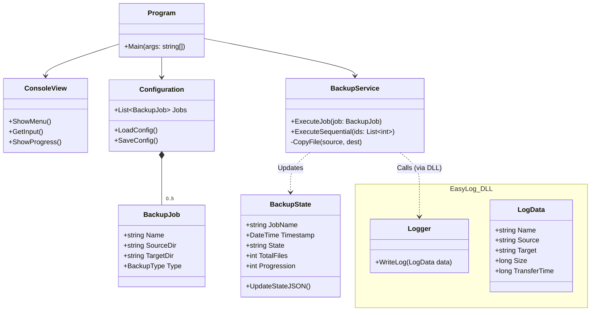
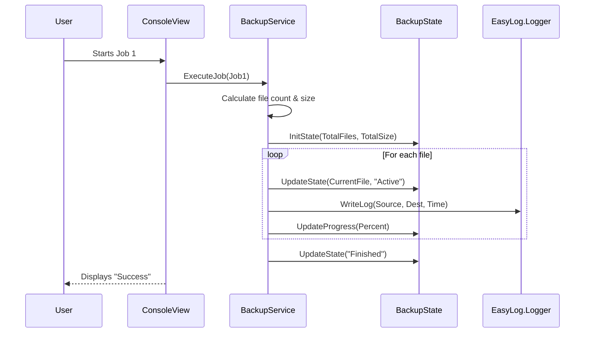

# Architecture EasySave 1.0 - Livrable 1

Here UML diagrams for the first deliverable

## 1. Use Case

```mermaid
graph LR
    %% Actor
    U((User))

    %% System Boundary
    subgraph "EasySave 1.0 (Console)"
        %% Use Cases
        UC_Create([Create a Backup Job])
        UC_List([List Backup Jobs])
        UC_Delete([Delete a Backup Job])
        UC_Exec([Execute Backup Job_s_])
        UC_Lang([Change Language EN/FR])

        %% Detailed Cases
        UC_Full([Full Backup])
        UC_Diff([Differential Backup])
        UC_One([Execute One Job])
        UC_All([Execute All Jobs])

        %% Internal Actions
        UC_Log([Generate Daily Log JSON])
        UC_State([Update Real-Time State JSON])
    end

    %% Relations
    U --> UC_Create
    U --> UC_List
    U --> UC_Delete
    U --> UC_Exec
    U --> UC_Lang

    %% Generalization (Inheritance)
    UC_Full --> UC_Create
    UC_Diff --> UC_Create
    UC_One --> UC_Exec
    UC_All --> UC_Exec

    %% Includes (Dependencies)
    UC_Exec -.->|include| UC_Log
    UC_Exec -.->|include| UC_State

    %% Constraint Note
    UC_All --- N[Sequential Execution<br/>Max 5 Jobs]
    style N fill:#fff,stroke:#333,stroke-dasharray: 5 5
```

## 2. Class

```mermaid
classDiagram
    class Program {
        +Main(args: string[])
    }

    class ConsoleView {
        +ShowMenu()
        +GetInput()
        +ShowProgress()
    }

    class Configuration {
        +List~BackupJob~ Jobs
        +LoadConfig()
        +SaveConfig()
    }

    class BackupJob {
        +string Name
        +string SourceDir
        +string TargetDir
        +BackupType Type
    }

    class BackupService {
        +ExecuteJob(job: BackupJob)
        +ExecuteSequential(ids: List~int~)
        -CopyFile(source, dest)
    }

    class BackupState {
        +string JobName
        +DateTime Timestamp
        +string State
        +int TotalFiles
        +int Progression
        +UpdateStateJSON()
    }

    namespace EasyLog_DLL {
        class Logger {
            +WriteLog(LogData data)
        }
        class LogData {
            +string Name
            +string Source
            +string Target
            +long Size
            +long TransferTime
        }
    }

    Program --> ConsoleView
    Program --> Configuration
    Program --> BackupService
    Configuration *-- "0..5" BackupJob
    BackupService ..> BackupState : Updates
    BackupService ..> Logger : Calls (via DLL)
```

## 3. Sequence Diagram

```mermaid
sequenceDiagram
    participant User
    participant View as ConsoleView
    participant Service as BackupService
    participant State as BackupState
    participant DLL as EasyLog.Logger

    User->>View: Starts Job 1
    View->>Service: ExecuteJob(Job1)
    
    Service->>Service: Calculate file count & size
    Service->>State: InitState(TotalFiles, TotalSize)
    
    loop For each file
        Service->>State: UpdateState(CurrentFile, "Active")
        Service->>DLL: WriteLog(Source, Dest, Time)
        Service->>State: UpdateProgress(Percent)
    end

    Service->>State: UpdateState("Finished")
    View-->>User: Displays "Success"
```