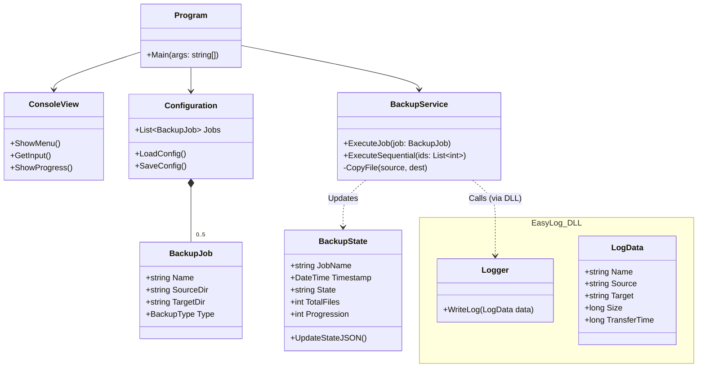
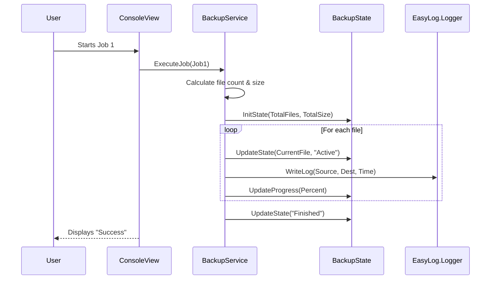

# Architecture EasySave 1.0 - Livrable 1

Here UML diagrams for the first deliverable

## 1. Use Case
```mermaid
usecaseDiagram
    actor "User" as U

    package "EasySave 1.0 (Console)" {
        usecase "Create a Backup Job" as UC_Create
        usecase "List Backup Jobs" as UC_List
        usecase "Delete a Backup Job" as UC_Delete
        usecase "Execute Backup Job(s)" as UC_Exec
        usecase "Change Language (EN/FR)" as UC_Lang

        %% Job Types
        usecase "Full Backup" as UC_Full
        usecase "Differential Backup" as UC_Diff

        %% Execution Types
        usecase "Execute One Job" as UC_One
        usecase "Execute All Jobs" as UC_All

        %% System Actions
        usecase "Generate Daily Log (JSON)" as UC_Log
        usecase "Update Real-Time State (JSON)" as UC_State
    }

    %% User Interactions
    U --> UC_Create
    U --> UC_List
    U --> UC_Delete
    U --> UC_Exec
    U --> UC_Lang

    %% Generalizations
    UC_Full --|> UC_Create
    UC_Diff --|> UC_Create
    UC_One --|> UC_Exec
    UC_All --|> UC_Exec

    %% Includes
    UC_Exec ..> UC_Log : <<include>>
    UC_Exec ..> UC_State : <<include>>

    %% Constraints
    note right of UC_All
        Sequential Execution
        Max 5 Jobs
    end note
```

## 2. Class


## 3. Sequence Diagram
