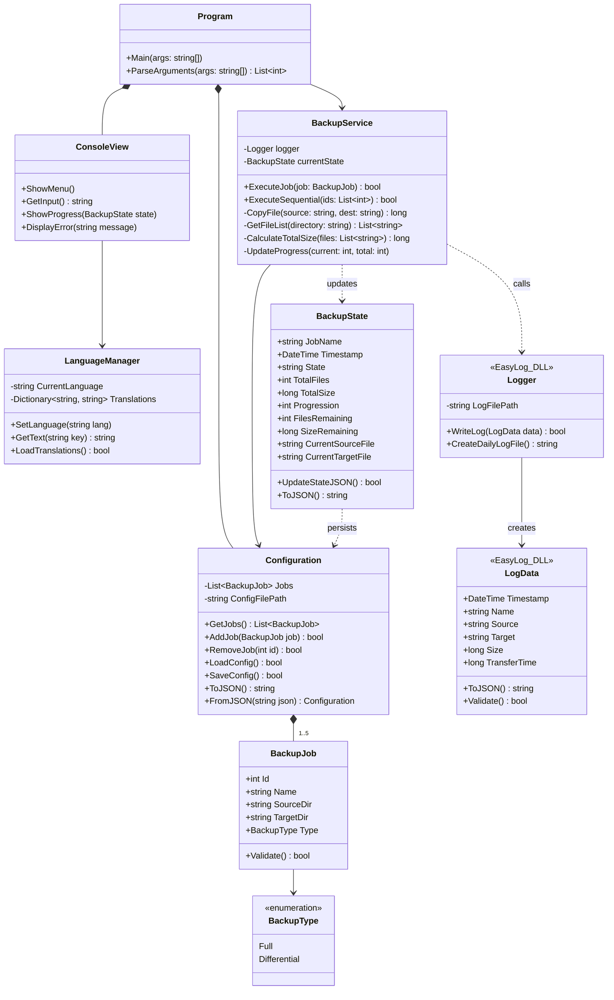
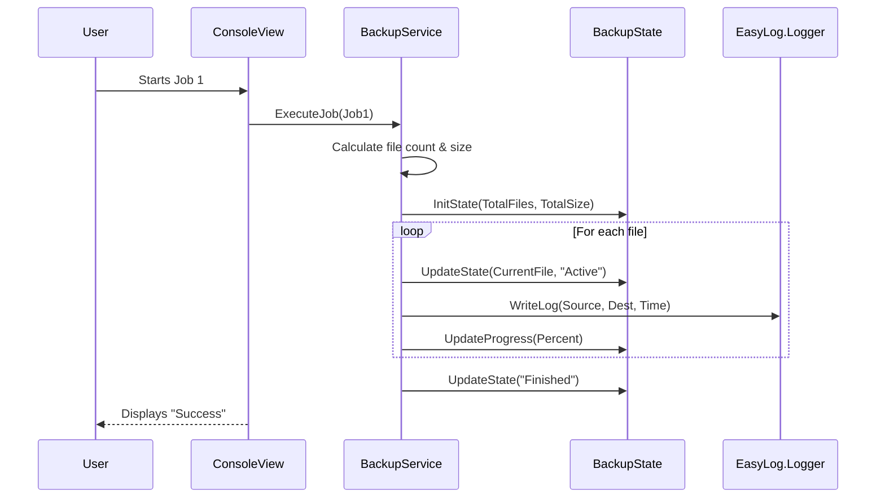

# Architecture EasySave 1.0 - Livrable 1

Here UML diagrams for the first deliverable

## 1. Use Case
```mermaid
usecaseDiagram
    actor "User" as U
    package "EasySave v1.0" {
        usecase "Create a backup job" as UC1
        usecase "Execute a backup job" as UC2
        usecase "Execute sequentially" as UC3
        usecase "Change language" as UC4
        usecase "Manage Daily Log" as UC_Log
        usecase "Update State" as UC_State
    }
    U --> UC1
    U --> UC2
    U --> UC3
    U --> UC4
    UC2 ..> UC_Log : include
    UC2 ..> UC_State : include
    UC3 ..> UC2 : extend
```

## 2. Class


## 3. Sequence Diagram
